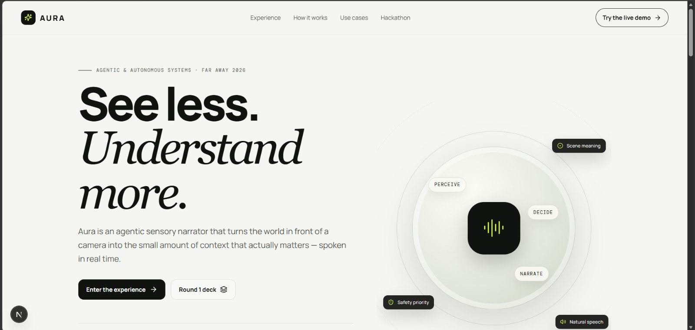
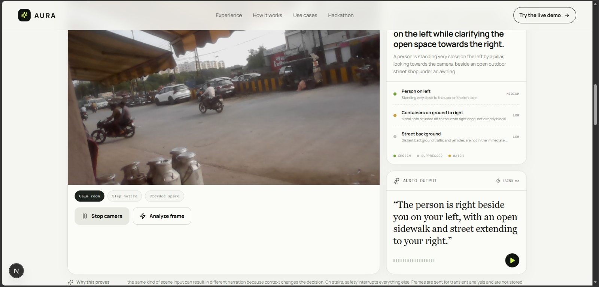
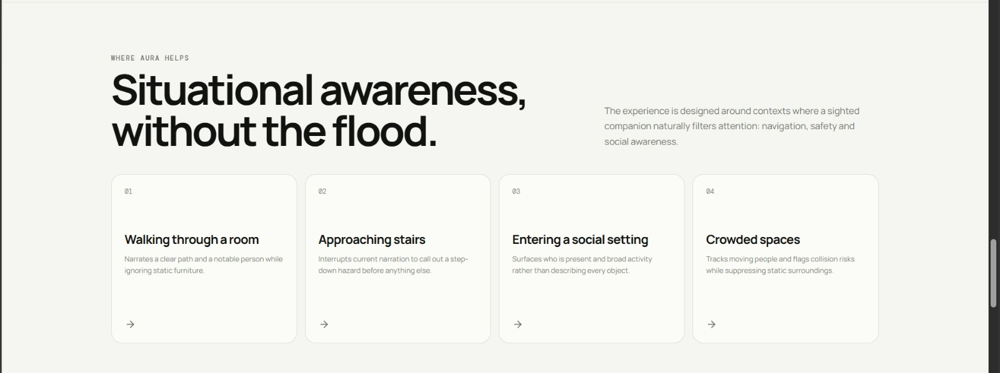

# Aura — Agentic Sensory Narrator

> **See less. Understand more.**
>
> Aura is an agentic sensory narrator for blind and low-vision users. Instead of reading every object aloud, Aura interprets a camera frame, decides what matters in the current context, suppresses low-value detail, and turns the result into natural-language audio.

<p align="center">
  
</p>

<p align="center">
  <strong>Perceive → Triage → Narrate</strong>
</p>

---

## 🚀 What this repository contains

This repository contains the Round 1 hackathon website and live prototype for Aura. The experience is designed to make the core agentic behavior visible to judges rather than presenting a generic AI wrapper.

### Core capabilities

- **Live camera input** from a laptop/phone webcam through the browser
- **Gemini multimodal analysis** through a server-side Next.js API route
- **Contextual triage** that separates important information from background clutter
- **Chosen / suppressed / watch** decision visibility for judges
- **Safety-priority interruptions** for hazards such as steps and obstacles
- **Natural-language narration** through browser speech synthesis
- **Scripted demo scenes** for reliable presentations when live camera/API access is unavailable
- **Round 1 PPT + GitHub** submission links in the Hackathon section

---

## 🎯 The problem Aura solves

Traditional navigation aids can identify immediate obstacles but provide limited contextual awareness. On the other extreme, many vision assistants describe too many objects, creating a noisy stream of information.

Aura focuses on the missing step: **judgment**.

> A sighted companion does not describe every chair, wall, and table. They surface the step, the clear path, the nearby person, or the collision risk that matters right now.

Aura's core agent therefore uses contextual triage:

- **Safety-critical information wins** and can interrupt narration.
- **Social context** is surfaced when there is no dominant hazard.
- **Static, repetitive, or irrelevant detail is suppressed** to reduce cognitive overload.

This follows the supplied Round 1 PRD's central requirement: the system should visibly decide what to communicate and what to ignore.

---

## 🧠 How Aura works

```text
┌────────────────────┐
│  Camera / Webcam   │
└─────────┬──────────┘
          │ frame
          ▼
┌────────────────────┐
│  Perception        │  Gemini multimodal model
│  Scene understanding│  objects / people / hazards / layout
└─────────┬──────────┘
          │ structured scene
          ▼
┌────────────────────┐
│  Triage Agent      │  contextual importance
│  Decide / suppress │  safety > social > static clutter
└─────────┬──────────┘
          │ prioritized context
          ▼
┌────────────────────┐
│  Narration         │  natural sentence generation
│  + Speech          │  browser SpeechSynthesis
└────────────────────┘
```

The Round 1 architecture maps directly to the PRD's perceive → decide → act loop: camera ingestion, multimodal perception, triage, and narration.

---

# ▶️ Judge Quick Start

A judge should be able to clone the repository and get to the demo with the steps below.

## 1. Requirements

Install:

- **Node.js 20+**
- **npm**
- A modern browser such as Chrome or Edge
- A webcam is recommended for the live demo
- A **Google Gemini API key** is required for live Gemini analysis

## 2. Clone the repository

```bash
git clone <YOUR_GITHUB_REPOSITORY_URL>
cd aura-hackathon-site
```

## 3. Install dependencies

```bash
npm install
```

## 4. Configure environment variables

Copy the example environment file:

### Windows PowerShell

```powershell
Copy-Item .env.example .env.local
```

### macOS / Linux

```bash
cp .env.example .env.local
```

Open `.env.local` and set:

```env
GEMINI_API_KEY=your_gemini_api_key
GEMINI_MODEL=gemini-3.8-flash

NEXT_PUBLIC_REPO_URL=https://github.com/your-team/your-repository
NEXT_PUBLIC_PPT_URL=https://drive.google.com/file/d/your-ppt-id/view
```

### Security

**Never commit `.env.local` or your real Gemini API key.** The repository ignores `.env*` while allowing `.env.example` to be committed.

## 5. Start the development server

```bash
npm run dev
```

Open:

```text
http://localhost:3000
```

---

# 🎬 How to demo Aura to a judge

The fastest way to understand the product is to use the Experience section and deliberately change the context.

### Scene A — Calm room

Select **Calm room**.

Explain:

> “Aura can see many things, but it does not read all of them aloud. It chooses the clear path and the nearby person while suppressing static furniture.”

The dashboard should show **chosen** items alongside **suppressed** clutter.

### Scene B — Step hazard

Select **Step hazard**.

Explain:

> “The context changed. Safety now dominates, so Aura interrupts the previous narration and surfaces the step immediately.”

This demonstrates the product's main agentic behavior: the same system makes a different communication decision because the situation changed.

### Scene C — Crowded space

Select **Crowded space**.

Explain:

> “Here the agent focuses on moving people and collision risk instead of spending attention on static background objects.”

### Live Gemini proof

For the real AI demonstration:

1. Allow camera access when the browser asks.
2. Click **Use camera**.
3. Point the camera at a real scene.
4. Click **Analyze frame**.
5. Aura sends the selected frame to the server-side Gemini endpoint.
6. The returned observation updates the triage dashboard and narration panel.

The live experience should show the actual camera frame, then update the **decision**, **chosen/suppressed/watch items**, and **audio output**.

<p align="center">
  
</p>

---

# 🖼️ Product screenshots

## Landing experience

The landing page introduces Aura's value proposition and the three-stage loop: **Perceive → Decide → Narrate**.

<p align="center">
  
</p>

## Situational awareness use cases

The website presents the four core contexts from the PRD: room navigation, stairs, social settings, and crowded spaces.

<p align="center">
  
</p>

## Live operator experience

The Experience section is designed as the judge-facing proof layer: the camera feed sits beside Aura's decision and audio output so the agent's filtering is visible.

<p align="center">
  
</p>

---

# 🏗️ Technical implementation

### Frontend

- Next.js
- React
- TypeScript
- Custom CSS
- Lucide icons

### AI / perception

- Google Gemini multimodal model
- Server-side Next.js route at `/api/aura/observe`
- JSON-structured observation contract
- Defensive response parsing and transient-error handling

### Narration

- Browser **SpeechSynthesis** for the prototype
- Narration text is generated from the selected context

### Reliability

- Scripted fallback scenes for stage demonstrations
- Retry/fallback handling for transient Gemini availability errors
- Client-side protection against malformed or incomplete observations

---

# 📁 Project structure

```text
aura-hackathon-site/
├── app/
│   ├── api/
│   │   └── aura/
│   │       └── observe/
│   │           └── route.ts      # Gemini observation endpoint
│   ├── globals.css               # Global styling
│   ├── layout.tsx
│   └── page.tsx
├── components/
│   └── AuraApp.tsx               # Main product experience
├── lib/
│   ├── aura-prompt.ts            # Agent / perception prompt
│   └── demo-scenes.ts             # Scripted fallback scenes
├── public/
├── docs/
│   └── screenshots/               # README product screenshots
├── .env.example
├── .gitignore
├── package.json
└── README.md
```

---

# 🔐 Environment variables

| Variable | Required | Purpose |
|---|---|---|
| `GEMINI_API_KEY` | Yes for live AI | Google Gemini API key |
| `GEMINI_MODEL` | Recommended | Gemini model used for scene analysis |
| `NEXT_PUBLIC_REPO_URL` | Optional | GitHub repository link shown on the site |
| `NEXT_PUBLIC_PPT_URL` | Optional | Round 1 PPT / deck link shown on the site |

The real Gemini key belongs in `.env.local`, not in source code or GitHub.

---

# 🧪 Useful commands

```bash
# Development
npm run dev

# Production build
npm run build

# Start a production build
npm start
```

---

# 🛟 Troubleshooting

### Camera is not visible

Make sure the browser has camera permission and use `http://localhost:3000` rather than an arbitrary file path. If the camera light is on but the video looks black, stop/restart the dev server and reload the page.

### Gemini returns a temporary 503 / unavailable error

The live request path includes retry/fallback handling for transient Gemini availability errors. During a presentation, you can also use the built-in scripted scenes so the triage concept remains demonstrable.

### Gemini returns malformed JSON

The API route defensively strips Markdown JSON fences and validates the expected observation structure before returning data to the UI.

### No Gemini key available

You can still explore the landing page and scripted **Calm room / Step hazard / Crowded space** scenes. Live camera-to-Gemini analysis requires `GEMINI_API_KEY`.

---

# 📊 Round 1 submission links

The website's **Hackathon** section exposes two submission actions:

- **Round 1 PPT** — configured through `NEXT_PUBLIC_PPT_URL`
- **GitHub repo** — configured through `NEXT_PUBLIC_REPO_URL`

After replacing the placeholders in `.env.local`, restart the dev server so Next.js reads the updated environment variables.

For a deployed build, configure the same variables in the hosting platform's environment settings.

---

# 👥 Team

**Team size:** 5 members

The project is intended for a five-member hackathon team and is structured so the public website can serve as the product explanation, live demo surface, and submission hub.

---

# 📌 Round 1 scope

The supplied PRD defines these as core Round 1 requirements:

- live phone/webcam input
- structured scene understanding
- autonomous contextual triage
- natural-language narration
- speech output
- visible operator dashboard

Custom wearable hardware, offline/on-device inference, multilingual narration, and advanced emotion/social-cue interpretation are treated as future or stretch scope rather than core Round 1 claims.

---

# ⚠️ Prototype / safety note

Aura is a hackathon prototype intended for demonstration. It should **not** be treated as a replacement for a cane, guide dog, human assistance, or other safety-critical accessibility equipment. Live perception can fail, especially under poor lighting, occlusion, motion blur, or network/API interruptions.

The PRD also calls for transient processing rather than storing camera video; the demo architecture follows that principle.

---

## Built around one idea

> **Aura does not try to tell you everything it sees. It tries to tell you what matters.**

For Round 1, the key demonstration is not object detection by itself. It is the agent's ability to **change what it communicates when the context changes**.
